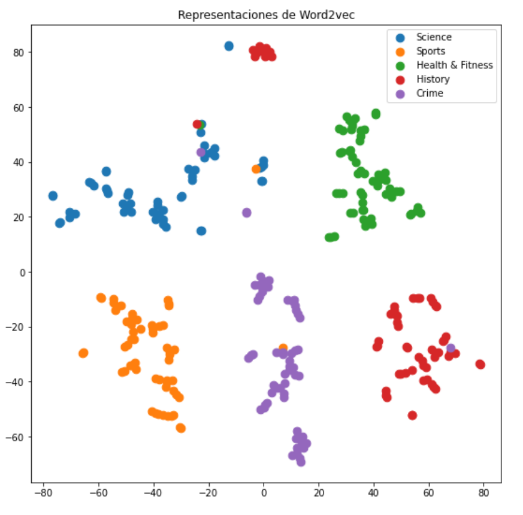
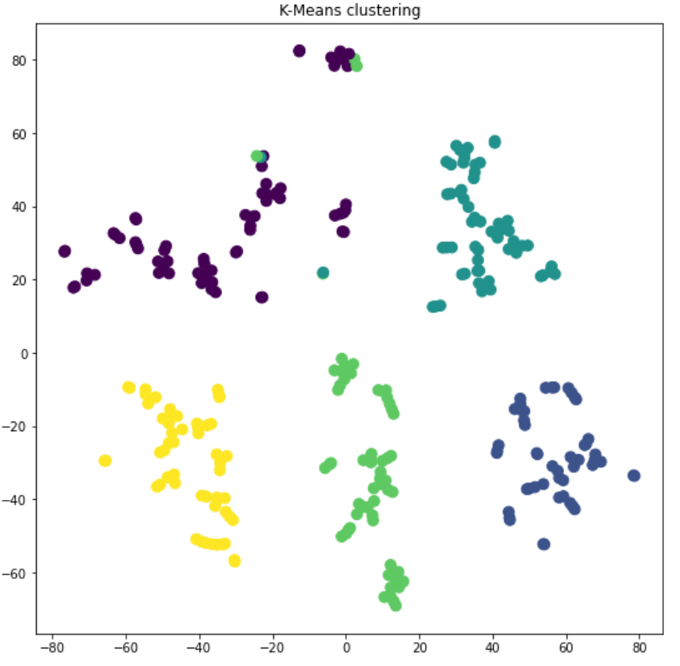
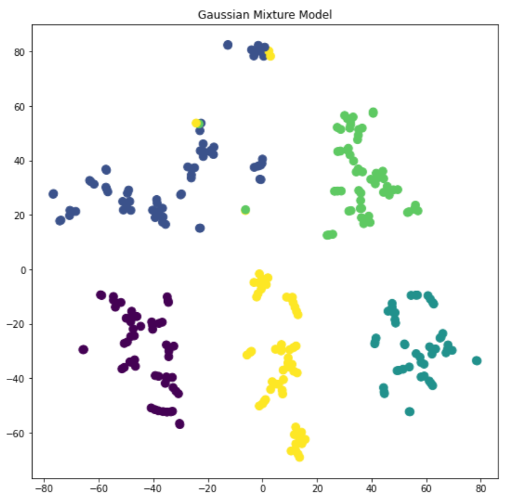
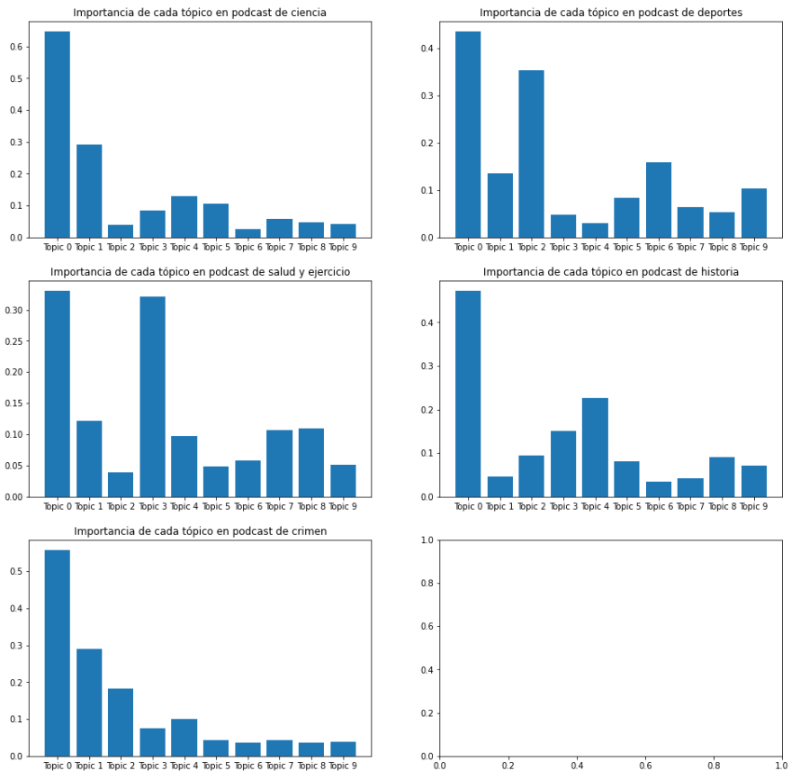

# Clustering and topic models on podcasts

This project was completed following up the next objectives:

* Analyze the set of scripts of different episodes of podcasts, so that explicit and implicit information is extracted from said set for the benefit of a company that wants to classify this type of content based on the expressed vocabulary and the topics contained there.
* Carry out a data extraction from the web of the data to be used and apply natural language preprocessing (NLP) techniques on the mentioned data, so that it optimizes the results of the models to be implemented.
* Represent the sets of texts, tokenized and non-tokenized, in a suitable vector space, in such a way that they may be suitable for use them in unsupervised learning models.
* Train grouping and topics models appropriately to classify and find themes in the analyzed data sets, as well as evaluate those trained models in order to know their reliability and usefulness.

## About this project

A brief description of the folders of this project and the methodology followed is shown below:

* 1. Data extraction: The analized texts are loaded using web scraping.
* 2. Data preparation and exploration: Cleaning and preprocessing operations, and also features extraction are made on the texts in the files: [Preprocessing.ipynb](https://github.com/cagutierrezgu/My_Portfolio/blob/196d47d1b5194837e198d295002a3245cd312f65/Podcast%20topic%20classification/2.%20Data%20preparation%20and%20exploration/1.%20Preprocessing.ipynb), [Features.ipynb](https://github.com/cagutierrezgu/My_Portfolio/blob/196d47d1b5194837e198d295002a3245cd312f65/Podcast%20topic%20classification/2.%20Data%20preparation%20and%20exploration/2.%20Features.ipynb)
* 3. Models: The words are represented in spaces of greater dimensions such as Word2Vec, and unsupervised learning models of grouping and topics are done in the notebooks: [Clusters.ipynb](https://github.com/cagutierrezgu/My_Portfolio/blob/196d47d1b5194837e198d295002a3245cd312f65/Podcast%20topic%20classification/3.%20Models/1.%20Clusters.ipynb), [Topics.ipynb](https://github.com/cagutierrezgu/My_Portfolio/blob/196d47d1b5194837e198d295002a3245cd312f65/Podcast%20topic%20classification/3.%20Models/2.%20Topics.ipynb).
* 4. Evaluation: The models are appropriately evaluated with some metrics to verify their results in the files: [Clusters_evaluation.ipynb](https://github.com/cagutierrezgu/My_Portfolio/blob/196d47d1b5194837e198d295002a3245cd312f65/Podcast%20topic%20classification/4.%20Evaluation/1.%20Clusters_evaluation.ipynb), [Topics_evaluation.ipynb](https://github.com/cagutierrezgu/My_Portfolio/blob/196d47d1b5194837e198d295002a3245cd312f65/Podcast%20topic%20classification/4.%20Evaluation/2.%20Topics_evaluation.ipynb).

The folder named "Emotions_vocab" contains a .zip file with the vocabulary of some human emotions, and is used in [Features.ipynb](https://github.com/cagutierrezgu/My_Portfolio/blob/196d47d1b5194837e198d295002a3245cd312f65/Podcast%20topic%20classification/2.%20Data%20preparation%20and%20exploration/2.%20Features.ipynb).

## Model and results

In order to apply machine learning algorithms on the data, it was useful to make representations of the texts suchs as Word2vec, as it can be seen in the next figure

Where color distinction was made for each of the podcasts to be studied. At first glance, some clusters can be seen that seem to be distinguished by the theme of each podcast, and this is precisely what was studied with some models in the model section.

One of the most used and simple models for grouping tasks is K-Means, for which it was used sklearn.cluster.KMeans and as a first model it was set the number of clusters to 5, obtaining

where a classification similar to that of the original labels is observed. On the other hand, another clustering model studied was the Gaussian Mixture Model (GMM), so setting again 5 clusters to compare with the labels of each podcast, the classification made is the next

Which presents a classification quite similar to that seen by the K-Means model.

In addition to the cluster models, topic ones are of great importance, and that because hidden themes can be discovered within texts that were initially cataloged as a single specific theme. One of the models to use on the data set is the Latent Semantic Analysis (LSA), and the topics this model found, setting 10 topics in all podcasts, are the following

* Topic 0: radio fucking murder mike space movie food police sport public named mother died chris fuck
* Topic 1: youtube intelligence data fundamental physic perspective versus goal artificial aspect universe scale dial mindset useful
* Topic 2: espn mike chris billy football sport quarterback cody greg draft bowl miami playoff pirate player
* Topic 3: dial wake instagram mentor mindset goal grow fucking shower essful mission fear youtube negative happiness
* Topic 4: radio production missed dial included join visit museum mentor continued william century died various north
* Topic 5: freedom trump civil violence election politics president political vote constitution government police speech leader united
* Topic 6: quarterback draft brady playoff bowl football player season coach yard zone aaron jordan round ball
* Topic 7: wake grateful drink coffee artificial guest intelligence food science quarterback green negative seriously sleep playoff
* Topic 8: shower cold food focus eating january vote bathroom platform government design coffee south shift productive
* Topic 9: prize prediction king draft challenge wake sunday code ship bowl brady food pirate hedge blood

Within which there are some with an obvious theme, for example topics 1 and 2 correspond to science-technology and sports respectively. However, there are others with very general themes, such as topic 7. In general, an average of the importance of each topic in each of the podcasts was calculated and displayed as in the specific case above, then:

## Conclusions

The most relevant findings seen in the analysis done are the following:

* A study was done using all the texts uploaded from the web, leading to the creation of grouping and topic models that can be useful for further studies looking for the creation of recommendation models for the user based on the type of podcast they usually listen to.
* The use of libraries such as **`re`** and **`nltk`** were essential when carrying out the preprocessing of the texts used, even so, methods such as **`WordCloud`** and the Sentiment analysis showed that most of the times this preprocessing is not enough when there are very frequent words in the texts, which do not contribute to the analysis of topics, so it is necessary to make use of other techniques and more elaborate models.
* The representations of *Bag of Words*, *TF-IDF* and *Word2Vec* were implemented on the texts used and admitted a first approach to the groups that were formed, this reducing the dimensionality of those representations to 2 dimensions in the case of *Word2Vec*.
* The use of unsupervised learning models from libraries such as **`sklearn`** and **`gensim`** were essential to obtain more informative results about the texts studied. On the one hand, the trained clustering models suggest a number of topics $K=4$ after evaluating them with the *Silhouette coefficient* metric, while the evaluated topic model considers a number of topics up to $K=7$ . Although the two results should not generally match, they are somehow related and are close to the number of podcasts used $K=5$.
